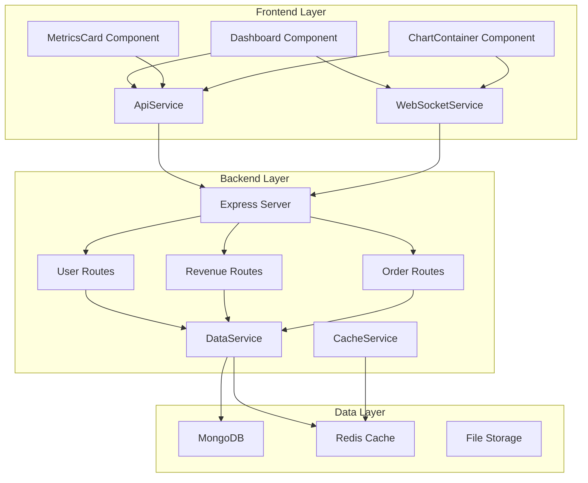
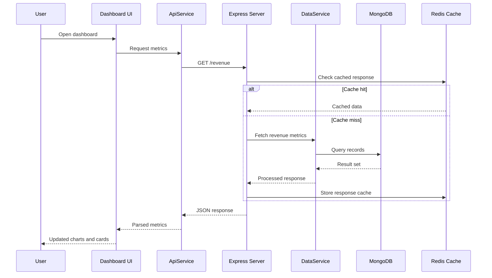
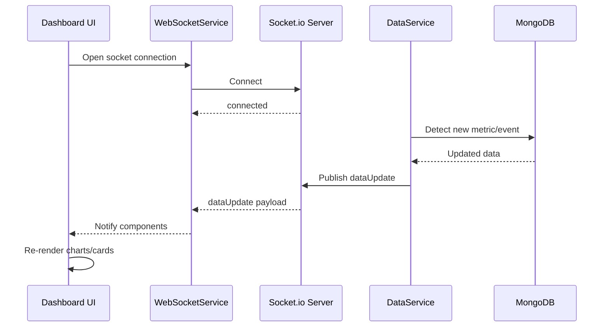

# System UML Diagrams

## 1. High-Level System Architecture

```mermaid
graph TB
	subgraph "Frontend Layer"
		A[Dashboard Component]
		B[MetricsCard Component]
		C[ChartContainer Component]
		D[ApiService]
		E[WebSocketService]
	end

	subgraph "Backend Layer"
		F[Express Server]
		G[User Routes]
		H[Revenue Routes]
		I[Order Routes]
		J[DataService]
		K[CacheService]
	end

	subgraph "Data Layer"
		L[MongoDB]
		M[Redis Cache]
		N[File Storage]
	end

	A --> D
	A --> E
	B --> D
	C --> D
	C --> E

	D --> F
	E --> F

	F --> G
	F --> H
	F --> I

	G --> J
	H --> J
	I --> J

	J --> L
	J --> M
	K --> M
```

## 2. API Request Flow (Sequence Diagram)

```mermaid
sequenceDiagram
	participant U as User
	participant FE as Dashboard UI
	participant API as ApiService
	participant BE as Express Server
	participant DS as DataService
	participant DB as MongoDB
	participant C as Redis Cache

	U->>FE: Open dashboard
	FE->>API: Request metrics
	API->>BE: GET /revenue
	BE->>C: Check cached response
	alt Cache hit
		C-->>BE: Cached data
	else Cache miss
		BE->>DS: Fetch revenue metrics
		DS->>DB: Query records
		DB-->>DS: Result set
		DS-->>BE: Processed response
		BE->>C: Store response cache
	end
	BE-->>API: JSON response
	API-->>FE: Parsed metrics
	FE-->>U: Updated charts and cards
```

## 3. Real-Time Update Flow (WebSocket)

```mermaid
sequenceDiagram
	participant FE as Dashboard UI
	participant WS as WebSocketService
	participant BE as Socket.io Server
	participant DS as DataService
	participant DB as MongoDB

	FE->>WS: Open socket connection
	WS->>BE: Connect
	BE-->>WS: connected

	DS->>DB: Detect new metric/event
	DB-->>DS: Updated data
	DS->>BE: Publish dataUpdate
	BE-->>WS: dataUpdate payload
	WS-->>FE: Notify components
	FE->>FE: Re-render charts/cards
```
