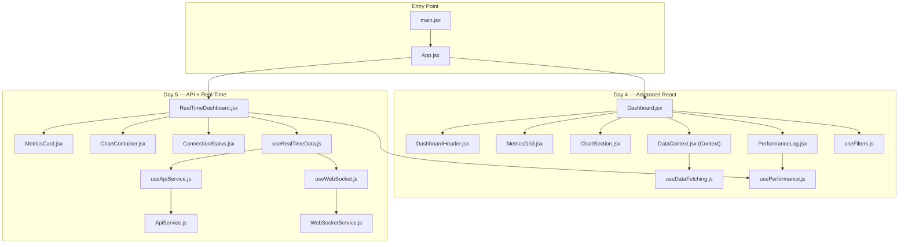
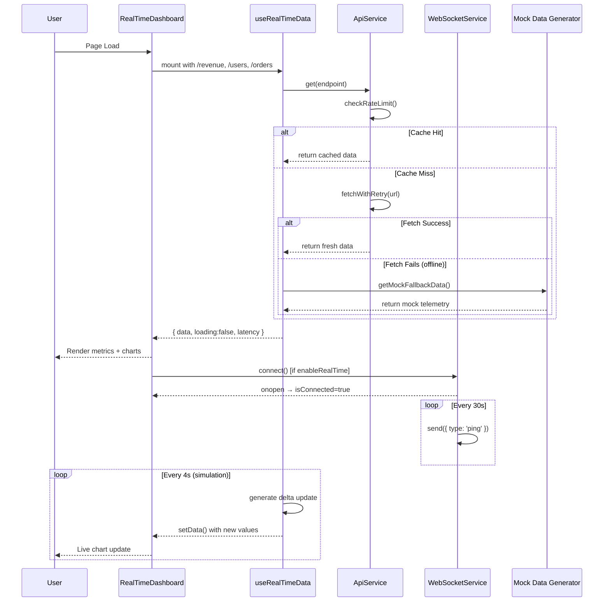
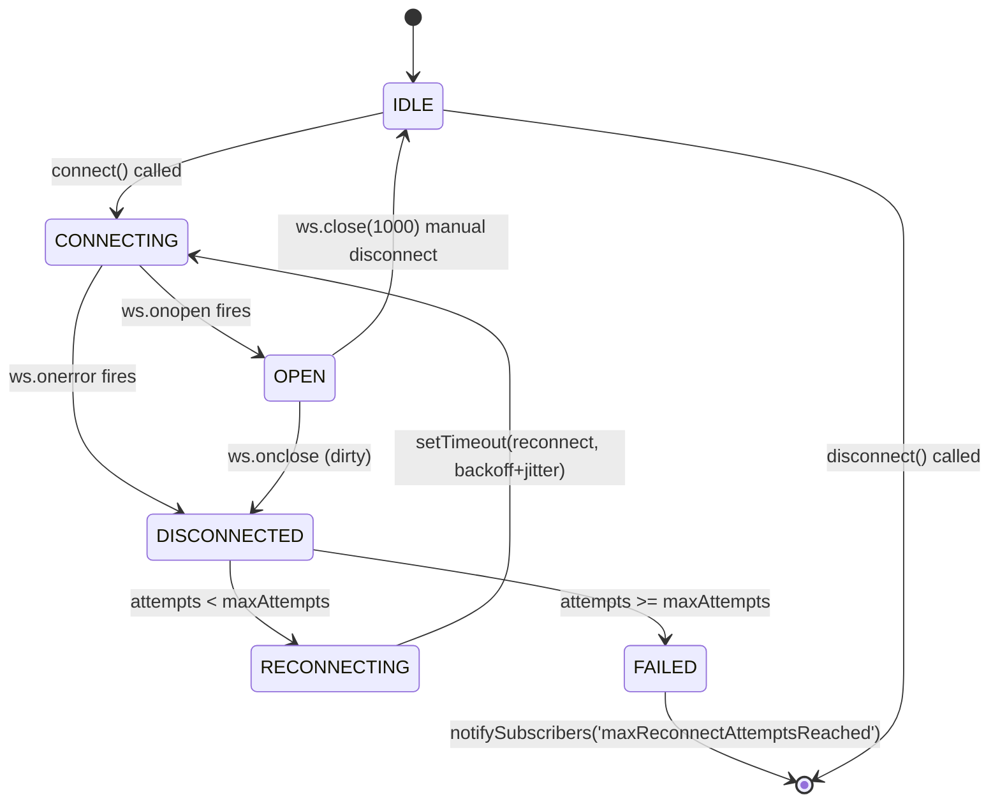
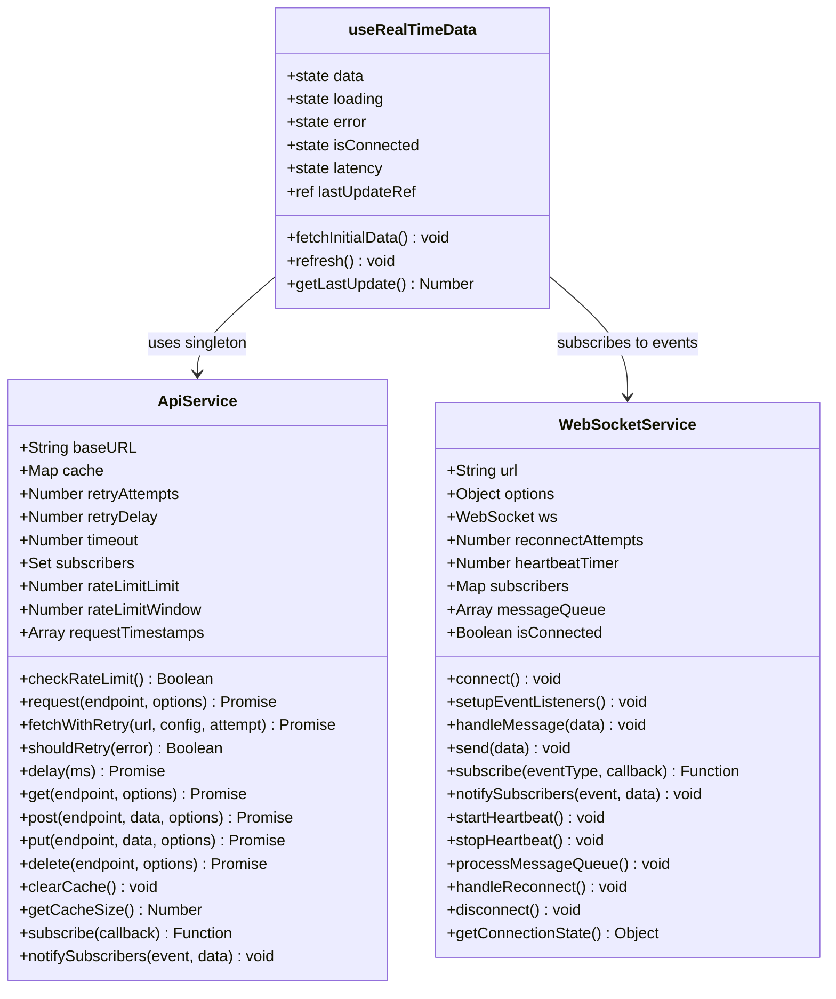

# UML Diagrams — Apex Telemetry Dashboard

> **Project:** SDA Training Week 1  
> **Scope:** Days 4 & 5 combined architecture diagrams

---

## 1. Component Dependency Graph



---

## 2. Data Flow Sequence Diagram



---

## 3. WebSocket Reconnection State Machine



---

## 4. ApiService Cache & Retry Class Diagram



---

## 5. Sprint Burndown Chart (ASCII)

```
Story Points Remaining
58 │█
54 │  █
50 │     █
45 │       █
38 │          █
30 │             █
20 │                █
12 │                   █
 5 │                      █
 0 │                         ●
   └─────────────────────────────
   Day1 Day2 Day3 Day4 Day5 Day6 Day7  (Sprint Timeline)
   
   █ = Actual Burndown   ● = Sprint Complete
```
