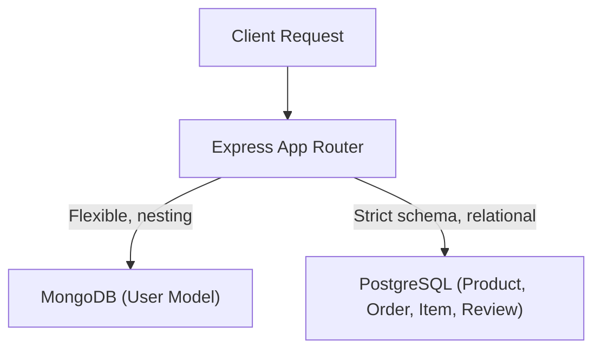

# Hybrid Database Architecture Guide

This document outlines the structural data layout, schema choices, indexing strategies, and connection designs implemented for Day 10.

---

## 🏛️ Hybrid Database Design

We implement a **polyglot persistence** architecture to leverage the distinct advantages of NoSQL and Relational database systems:



### 1. MongoDB (User & Profile Data)
- **Role**: Handles flexible user-centric entities.
- **Reasoning**: User profiles often contain variable nested configurations (e.g., UI preferences, notification options, variable social links) that benefit from NoSQL document nesting. Avoids high-cost table joins for sparse profile fields.
- **Engine**: Mongoose ODM.

### 2. PostgreSQL (Catalog & Transactional Data)
- **Role**: Stores products catalog, orders ledger, order items, and user reviews.
- **Reasoning**: Orders and checkout pipelines require strict schema validation, foreign key integrity constraints, check constraints (e.g., `stock >= 0`, `price >= 0`), and ACID transactions to prevent stock overselling and double-charging.
- **Engine**: Connection pool via `pg` driver.

---

## 🚦 Closure-Based Connection Factories

Following the factory function guideline, both database connect modules have been restructured from class constructs to closure functions:

```javascript
// database/postgresql.js
function createPostgreSQLConnection() {
  let pool = null;
  let isConnected = false;

  const connect = async () => { ... };
  const query = async (text, params) => { ... };

  return { connect, query, getConnectionStatus, ... };
}
```

### Key Technical Advantages:
1. **Encapsulated State**: The underlying connection instances (Mongoose context and PG pool) are enclosed inside the scope of the factory function, making it impossible to override them externally.
2. **Simplified Context binding**: Eliminates JavaScript `this` binding issues when passing DB client helper methods to routers or services.

---

## 🗄️ Database Schemas & Relations (PostgreSQL)

Our relational schema ensures data integrity using cascading constraints and automatic timestamps:

```
┌──────────────────┐          ┌──────────────────┐
│     products     │◄─────────┤   order_items    │
├──────────────────┤          ├──────────────────┤
│ id (PK)          │          │ id (PK)          │
│ name             │          │ order_id (FK) ───┼──┐
│ price (>=0)      │          │ product_id (FK)  │  │
│ stock (>=0)      │          │ price (>=0)      │  │
└────────┬─────────┘          │ quantity (>0)    │  │
         │                    └──────────────────┘  │
         │                                          │
         │                    ┌──────────────────┐  │
         │                    │      orders      │◄─┘
         │                    ├──────────────────┤
         │                    │ id (PK)          │
         │                    │ customer_id      │
         │                    │ status (CHECK)   │
         │                    └──────────────────┘
         │                    ┌──────────────────┐
         └───────────────────►│     reviews      │
                              ├──────────────────┤
                              │ id (PK)          │
                              │ product_id (FK)  │
                              │ rating (1-5)     │
                              └──────────────────┘
```

### Reference Integrity rules:
- **Cascading deletes**: If a product is deleted, all its associated `order_items` and `reviews` are automatically removed (`ON DELETE CASCADE`) to prevent orphaned foreign keys.
- **Validation Constraints**: Prices must be non-negative (`price >= 0`), stocks must be non-negative (`stock >= 0`), order quantities must be strictly positive (`quantity > 0`), and reviews rating must fall within `[1, 5]`.

---

## ⚡ Indexing Strategy

### 1. MongoDB (User indexes)
- `email: 1` (Unique): Optimizes authentication queries.
- `role: 1`: Speeds up administrative searches.
- `isActive: 1`: Filters out inactive profiles fast.
- `createdAt: -1`: Optimizes page sorting.

### 2. PostgreSQL (Relational indexes)
- `idx_products_category` & `idx_products_price`: For rapid storefront filter sorting.
- `idx_orders_customer` & `idx_orders_status`: For customer order lists.
- `idx_order_items_order` & `idx_reviews_product`: Speeds up relational joins on foreign keys during queries.
