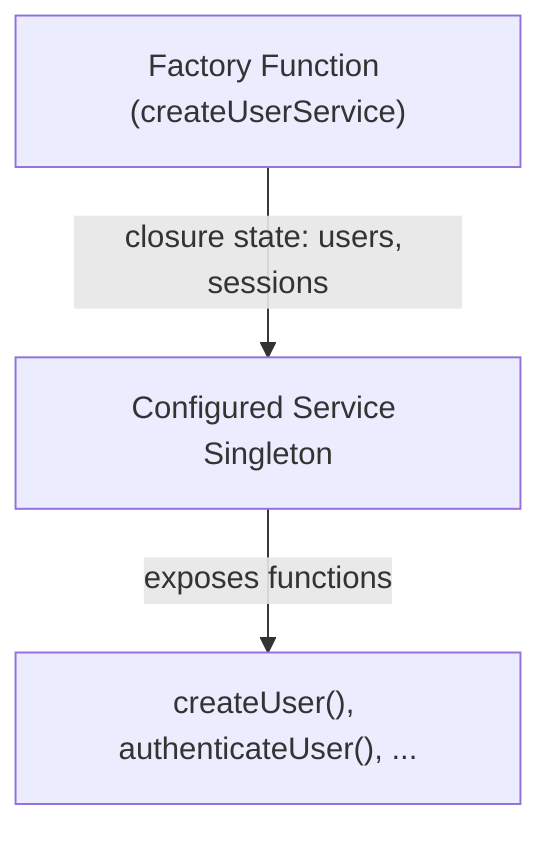

# Express.js Application Architecture Guide

This document explains the design decisions, component patterns, and security practices implemented in the Day 9 Express & Middleware application.

---

## 🏗️ Design Patterns: Factory Functions vs. Classes

In alignment with functional programming principles, all services, the main application setup, and specific middlewares are written as **factory functions** rather than ES6 classes.



### Benefits of the Factory Pattern:
1. **Encapsulation (Private State)**: State variables (like in-memory maps, API credentials, or internal configurations) are enclosed in function closures. They are inaccessible from the outside scope, preventing direct manipulation.
2. **No `this` binding issues**: Methods can be safely exported or passed as direct callback references without risk of losing context (e.g. avoiding the need for `.bind(this)`).
3. **Simpler Mocking & Testability**: Since services return plain objects of functions, they can be easily stubbed or decorated during unit tests.

---

## 🚦 Request / Response Life Cycle

```
[Incoming Request]
       │
       ▼
┌─────────────────────────────────────────────────────────┐
│                 Global Security & Setup                 │
│  - Helmet (headers protection)                          │
│  - CORS (origin checking)                               │
│  - Compression (gzipping payloads)                     │
│  - Rate Limiter (sliding window protection)             │
└─────────────────────────────────────────────────────────┘
       │
       ▼
┌─────────────────────────────────────────────────────────┐
│                 Telemetry & Parsing                     │
│  - Morgan (HTTP standard format output)                │
│  - Custom Performance Middleware (timing metrics)        │
│  - Body Parsers (JSON limit & urlencoded limit)         │
└─────────────────────────────────────────────────────────┘
       │
       ▼
┌─────────────────────────────────────────────────────────┐
│                    Route Matching                       │
│  - /health check                                        │
│  - /api/users, /api/products, /api/orders               │
└─────────────────────────────────────────────────────────┘
       │
       ├─► [Optional: Auth Middleware] ──► [Optional: Validation Middleware]
       │                                            │
       ▼                                            ▼
┌──────────────────────────────────┐        ┌──────────────────┐
│      Target Route Controller     │        │  Validation Fail │
│  - Calls Factory Services        │        │  - Throws Error  │
└──────────────────────────────────┘        └──────────────────┘
       │                                            │
       └──────────────────┬─────────────────────────┘
                          │ (next(err))
                          ▼
┌─────────────────────────────────────────────────────────┐
│              Centralized Error Handler                  │
│  - Winston records JSON trace                           │
│  - createAppError maps properties                       │
│  - Sends unified error envelope payload                 │
└─────────────────────────────────────────────────────────┘
```

---

## 🔒 Security Middleware Stack

We ensure comprehensive protection by positioning security middlewares at the very top of our stack:

1. **Helmet**: Sets secure HTTP response headers (e.g., Content-Security-Policy, X-Frame-Options, Strict-Transport-Security) to defend against clickjacking and XSS.
2. **CORS (Cross-Origin Resource Sharing)**: Restricts access to authorized domains with `credentials: true` support for secure cookie/token handshakes.
3. **Express Rate Limit**: Configured to restrict clients to 100 requests per 15-minute window (`/api/` routes), mitigating brute-force and Denial-of-Service attacks.

---

## 🧪 Input Validation & Sanitation Pipe

We use `express-validator` to define declarative validation rules. Rules are combined as middleware arrays that run sequentially:

- **Validation Phase**: Schema checks (e.g., matching UUIDs for IDs, validating email formats, complex regex validation for passwords).
- **Sanitation Phase**: Standardizing incoming values (e.g., `trim()`, `normalizeEmail()`).
- **Resolution Phase (`handleValidationErrors`)**: Inspects results. If errors exist, it throws a mapped validation error directly into the error-handling chain.

---

## 🛑 Error Mapping and Propagation

All operational errors are constructed using the `createAppError` factory function.

```javascript
// Example usage in controllers:
throw createAppError('Product not found', 404);
```

When an error is thrown or passed via `next(err)`, the **Centralized Error Handler** catches it:
- Normalises Mongoose/Sequelize schemas, JWT signatures, rate limit triggers, or generic errors into a unified response schema.
- Uses **Winston** to log standard JSON diagnostic traces (timestamp, url, method, stack, ip).
- Excludes full stack traces in production environment to avoid disclosure of system internals.